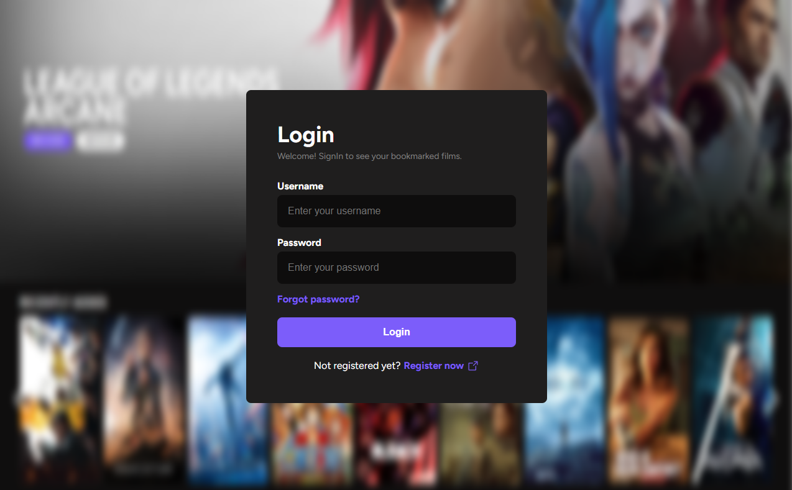
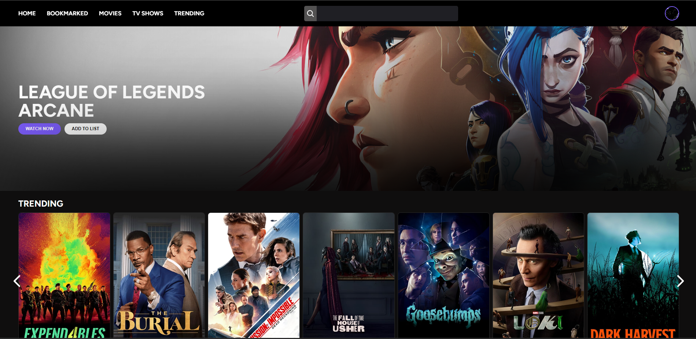
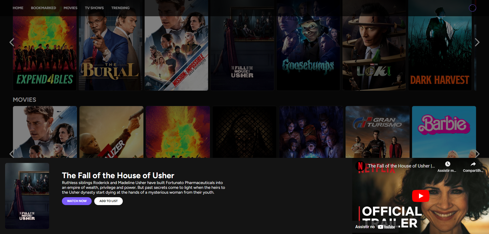
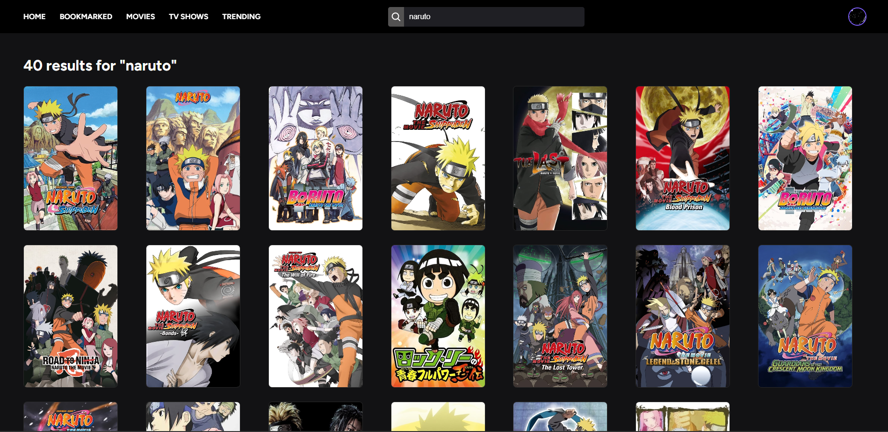
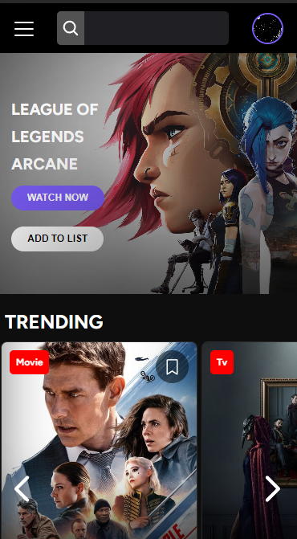
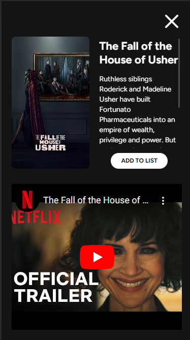
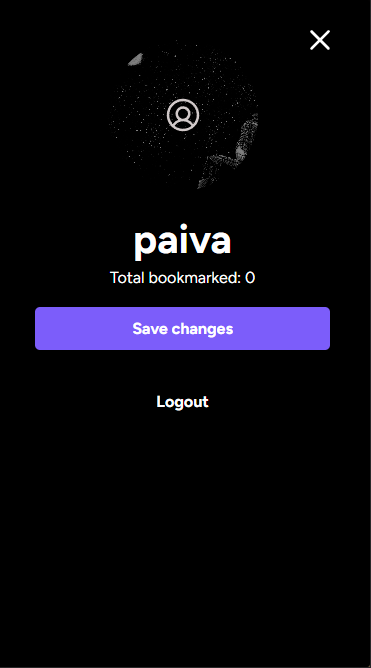

# Movie App - Fullstack App

This application was created with the intention of practicing my backend and frontend development skills. It features a movie app where users can create an account, log in, reset their password if forgotten, and update their profile picture. Users can also view the movies they have rented. The app categorizes content into movies, TV shows, and trending items, allowing users to explore each category. Clicking on a movie or TV show provides a brief description and a video preview. Users can also search for content based on the title.

## Tech used

Both the front-end and back-end were developed by me (except for the movie API, which is TMDB's).

Front-end:

- React
- TypeScript
- Styled Components

Back-end:

- Express
- NodeJS
- Jest for unit tests
- Docker
- Postgres

## Preview

<iframe width="640" height="360" src="https://www.loom.com/embed/ed871ce1cfab4a1daeac60b5d6506083?sid=ca4629d6-168d-4fe7-9c6f-58c784f0af0f" frameborder="0" webkitallowfullscreen mozallowfullscreen allowfullscreen></iframe>

# Screenshots

